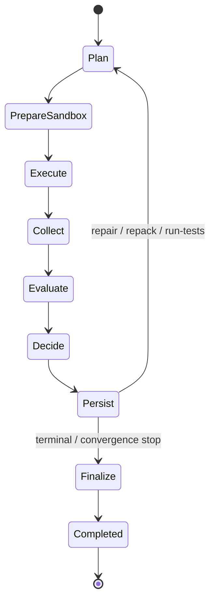

# Runtime State Machine

[中文](runtime-state-machine.zh-CN.md) | English

Runtime state is written under:

```txt
.agent-context/runs/<task-id>/state.json
```

Typical states:

- `EMPTY`
- `CONTEXT_READY`
- `TASK_PACK_READY`
- `EDIT_BOUNDARY_READY`
- `AGENT_STARTED`
- `EDITED`
- `VERIFYING`
- `REPAIRING`
- `READY_FOR_REVIEW`
- `BLOCKED`

The state file records:

- current state and previous state
- task id
- repository/context/diff hashes
- last action
- blocking next action
- allowed actions
- satisfied evidence
- missing evidence

The state machine is intentionally explicit. OpenCode++ reports the next allowed action; the external code agent, user, or CI workflow executes it.

## Iteration Convergence

Harness-led runs also record a deterministic convergence fingerprint for every iteration. The fingerprint contains:

- current working-tree hash
- raw Harness decision action
- blocking finding and Guard Gate IDs
- missing evidence
- required commands
- context freshness and drift

Array inputs are deduplicated and sorted before hashing, so the same logical state produces the same SHA-256 fingerprint regardless of collection order. The normalized fingerprint state is persisted beside the hash so a future resume flow can compare iterations without reconstructing transient in-memory objects.

Convergence statuses are:

- `progressing`: another repair, repack, or test iteration is allowed.
- `terminal`: an existing `finalize`, `block`, `rollback`, or `human-review` decision stopped the run.
- `executor-failure`: the executor returned a non-zero or unknown exit code.
- `repeated-state`: two consecutive blocking iterations produced the same fingerprint; the run stops with `human-review` and `repeated-state/no-progress`.
- `max-loops-reached`: the loop budget ended before a terminal decision. A single-loop run reports this status and cannot be classified as repeated state.

Convergence is written into the final orchestrator report, each iteration report, `iteration.json`, and `decision.json`.

## Context Refresh State

Each iteration report also persists a `contextRefresh` record. Its mode is one of:

- `reused`: no context builder call; the working tree and executor modification set show that the existing context is still applicable.
- `incremental`: the working tree changed and `buildContextPackage()` runs with its file/index/graph/token caches enabled.
- `rebuilt`: `repack`, context drift, or a dependency/configuration edit requires a cache-disabled full rebuild.

The record includes the selection reason, cache hit/miss counts, build count, and elapsed build duration. A resumed run loads this value from the Evaluate artifact, so Persist and Finalize do not reconstruct or double-count the completed context work. Freshness and drift remain evaluation inputs in all three modes.

## Orchestrator Phase State

Harness-led Orchestrator recovery uses a separate versioned state file:

```txt
.agent-context/orchestrator/<run-id>/state.json
```

The state records `schemaVersion`, `runId`, `currentPhase`, `currentIteration`, completed phase keys, executor/evaluation/iteration artifact references, trace reference, context fingerprint, working-tree hash, latest decision, convergence state, and timestamps. Unknown schema versions fail with an explicit compatibility error instead of being interpreted heuristically.



Every successful phase transition atomically rewrites `state.json`. Execute, Collect, Evaluate, Decide, and Persist also write phase artifacts under `.agent-context/runs/<run-id>/iterations/<iteration>/`. Resume uses `--resume <run-id>` and starts from `currentPhase`; completed phases are not executed again. Collect trace writes include deterministic iteration/event markers, so retrying after an interrupted persist cannot duplicate executor or normalized event steps.

Sandbox preparation remains process-local. A resumed git-worktree run creates a fresh worktree and reapplies the persisted executor patch before continuing. The sandbox adapter is discarded on successful completion, executor failure, phase interruption, and exceptions during post-prepare initialization.

## Desktop Task Resume

The Windows Desktop plugin has a separate task identity record for each `taskId` and `sessionId`:

```text
.agent-context/sidecar/task-identity-<task-id>-<session-id>.json
```

When a new OpenCode++ session is activated, the plugin only discovers and records candidates. It does not select the latest task automatically. `repositoryRoot` must match, and a resumable task must be unfinished. A matching latest working-tree fingerprint produces `resume-verification`; a changed fingerprint is marked `stale-task` and requires an explicit context/validation rebuild. A foreign repository is diagnostic-only and cannot be restored.

The `opencode_plusplus_resume` tool separates `inspect` from `resume`. Inspection reports candidate compatibility and persistence issues. Resume requires `confirmed: true` and a current target session. Compatible recovery creates a new session association and continues at `evaluate`; it does not treat old output as a new verification claim. Stale recovery retains the task id while rebuilding context and the validation plan. A pending human-review request can be located by task/request id across sessions; approval updates the boundary and returns the task to `dirty`, after which evaluation collects fresh evidence without restarting preparation.
