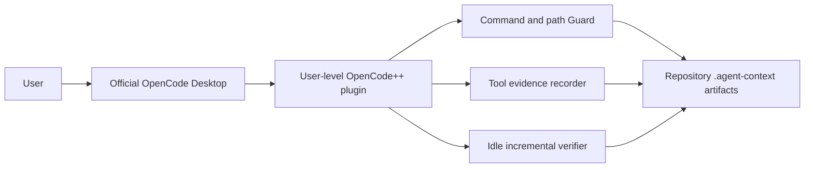

# OpenCode Global Sidecar

[中文](opencode-sidecar.zh-CN.md) | English

OpenCode++ is a global plugin for the official OpenCode Desktop application on Windows. The installer puts a bundled CommonJS plugin in the user's OpenCode configuration directory. Normal interactive use does not require the source repository or the OpenCode++ CLI.

## Runtime Boundary



The plugin handles `tool.execute.before`, `tool.execute.after`, `file.edited`, `file.watcher.updated`, and `session.idle`. OpenCode still owns model execution, tool dispatch, UI, authentication, and process lifecycle.

## Control Surface

The plugin exposes status and enable/disable controls as model-visible tools for compatibility, while the normal Desktop entry is the `opencode-plusplus` primary mode. The Windows installer no longer adds command menu entries or patches the Desktop bundle. A disabled plugin remains loaded and only bypasses Guard, evidence capture, and idle verification. The installer EXE can still use `--status`, `--enable`, or `--disable` outside Desktop for diagnostics.

Desktop Harness calls return structured JSON and a compact human-readable status by default. The structured `actionSummary` remains the recorded OpenCode++ result: `observed`, `prevented`, `requested`, `repaired`, `verified`, `unresolved`, and `human-review` entries identify what the plugin saw, blocked, requested, or verified. Call the Dashboard tool for the detailed view; human-review results also expose a `dashboard` field. The Dashboard and `.agent-context/sidecar/visualization.json` expose selected/rejected files, findings, missing evidence, required commands, working-tree hash, and intervention counts. A model-written task summary or commit list is not substituted for this record. See [Harness Output](../reference/harness-output.md).

## Evidence and Artifacts

After a tool call, the plugin records sanitized previews and hashes instead of unrestricted output. It records an exit code when the host supplies one; otherwise the result is `unknown`. It records before/after working-tree hashes and changed paths when available. Reports and traces are written under the current repository's `.agent-context/` through the shared atomic store. Tool events use the OpenCode call ID when available, so a repeated after-hook is idempotent in both the event log and execution trace. Concurrent hooks serialize through file locks and receive monotonic event sequences.

The sidecar is an evidence collection and verification layer. It is not a replacement for unit tests, code review, CI, an OS sandbox, or a security boundary against other applications.

## Relation to the Batch Harness

The Desktop sidecar is session-local and event-driven. The following CLI/MCP Harness flow is a developer-only compatibility example; it is not required for normal Desktop use:

```powershell
opencode-plusplus orchestrate "fix the login timeout and add a regression test" . --executor opencode --max-loops 3 --fail-on required
```

Both paths share Guard, Evidence, Policy, and decision implementations. Only the harness-led path owns executor invocation and terminal loop decisions.

## Troubleshooting

1. Fully restart OpenCode after installation or upgrade.
2. Check the active config directory and plugin file with `--status --json`.
3. Call `opencode_plusplus_status` from a new session.
4. Inspect `.agent-context/sidecar/latest.md` after a file edit and idle event.
5. Remove a legacy `.opencode/plugins/opencode-plusplus.ts` project plugin.

See [Windows installation and usage](opencode-desktop.md) for installer paths and lifecycle.
