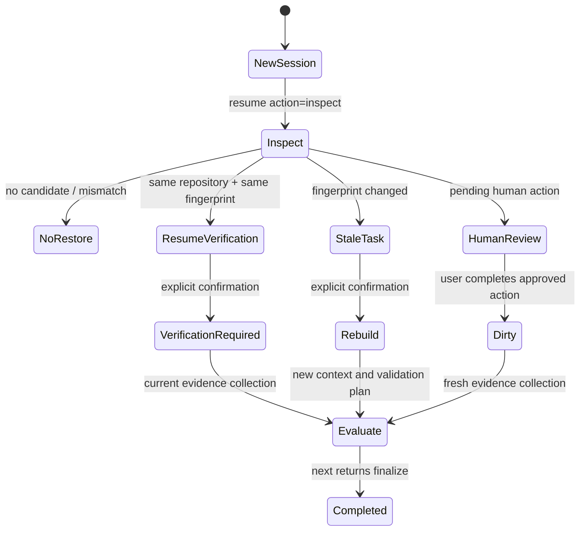

# Task Resume And Recovery

[中文](task-resume.zh-CN.md) | English

OpenCode++ keeps task recovery separate from OpenCode's model session. A new OpenCode Desktop session never inherits the most recent task merely because it is the most recent file on disk. Recovery requires an explicit identity match and, for an unfinished task, an explicit user-confirmed `opencode_plusplus_resume` call.

## Task Identity

Each prepared Desktop task with a session id has an atomic identity record at:

```text
.agent-context/sidecar/task-identity-<task-id>-<session-id>.json
```

The record contains:

| Field                          | Meaning                                                                                                |
| ------------------------------ | ------------------------------------------------------------------------------------------------------ |
| `sessionId`                    | The OpenCode session that created or continued the task.                                               |
| `repositoryRoot`               | The normalized repository root; Windows comparisons are case-insensitive.                              |
| `taskId`                       | The stable slug for the task.                                                                          |
| `baseWorkingTreeFingerprint`   | The tree fingerprint captured when the task began.                                                     |
| `latestWorkingTreeFingerprint` | The tree fingerprint captured at the latest persisted state.                                           |
| `status`                       | `active`, `dirty`, `verification-required`, `human-review`, `stale-task`, `completed`, or `abandoned`. |
| `updatedAt`                    | The last state transition time.                                                                        |
| `revision`                     | The atomic persistence revision, when present.                                                         |

The fingerprint is repository state, not model text. Runtime files under `.agent-context/` are excluded so writing recovery metadata does not make the task stale.

## Matching Rules

When OpenCode++ is activated in a new session, it discovers unfinished identities and stores diagnostic candidates in that session's workflow state. It does not restore any task automatically.

1. A different `repositoryRoot` is `mismatched-repository` and can never be restored from the current repository.
2. A completed or abandoned identity is `not-resumable`.
3. An unfinished identity whose latest fingerprint matches the current tree is `resume-verification`.
4. An unfinished identity whose latest fingerprint differs is marked `stale-task`; its context and validation plan must be rebuilt.
5. A `human-review` identity remains blocked until its recorded human action is completed.

The `opencode_plusplus_resume` tool has two explicit actions:

```json
{ "action": "inspect", "sessionId": "new-session" }
```

Inspection is read-only from the caller's perspective, reports candidates and diagnostics, and never changes the active task. To continue a selected task, the caller must supply the current session, source session, task id when needed, and `confirmed: true`:

```json
{
  "action": "resume",
  "taskId": "fix-login-timeout",
  "sourceSessionId": "old-session",
  "sessionId": "new-session",
  "confirmed": true
}
```

## Recovery Paths



### Compatible tree

OpenCode++ creates a new session association while retaining the task id and the source task's boundary/context references. The source identity is marked `abandoned` with `resumedToSessionId` for auditability. The new identity is `verification-required`, and the caller must evaluate the current tree before finalization. Old command output is not silently presented as a new session's evidence.

### Stale tree

OpenCode++ first marks the old identity `stale-task`. A confirmed stale recovery rebuilds the task context and validation plan against the current tree, retains the same task id, and returns `nextAction: evaluate`. It does not claim that the old evidence proves the changed tree.

### Human review

Human review is not a reset button. A pending request can be located by task and request id even when the user opens a new Desktop session. Approval updates the boundary revision, associates the existing task with the current session, changes the identity to `dirty`, and returns `nextAction: evaluate`. The next evaluation recollects evidence. Rejection abandons the continuation; it does not create a successful result.

## Isolation And Diagnostics

- Session-specific session, workflow, evaluate, identity, and human-review files are never selected solely by newest timestamp.
- Mismatched repository candidates remain diagnosable but are not copied into the current session.
- Corrupt JSON is reported as a persistence error; it is not treated as an empty task list.
- Repeated `resume` with the same source and target is idempotent and does not create a second task run.
- A completed task is closed when `next` returns `finalize`; repeating `next` does not advance its identity revision.
- If state cannot be read or written, the plugin returns a structured error and does not crash OpenCode Desktop.

Task recovery is a control-plane feature. It does not restore hidden model reasoning, bypass OpenCode permissions, execute commands, or provide operating-system sandboxing.
