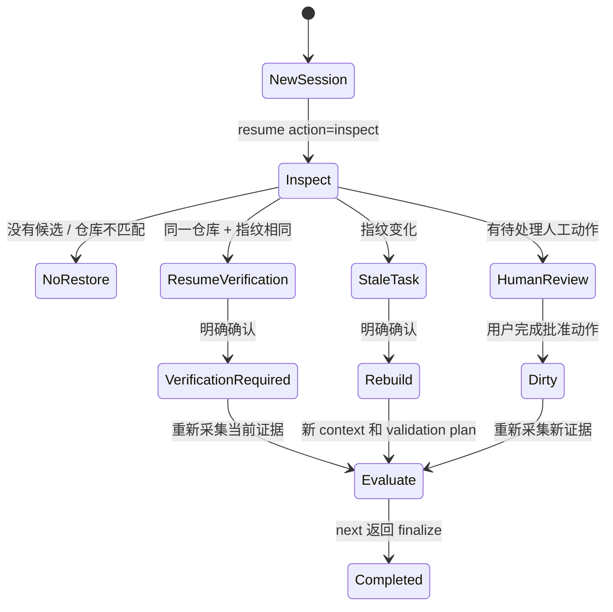

# 任务恢复与续接

[English](task-resume.md) | 中文

OpenCode++ 将任务恢复与 OpenCode 的模型会话分开管理。新的 OpenCode Desktop 会话不会因为磁盘上某个任务文件“最近被写入”就自动接管它。恢复必须通过明确的身份匹配；对于未完成任务，还必须由用户明确确认 `opencode_plusplus_resume`。

## 任务身份

每个带 session id 的 Desktop 任务在以下路径保存原子身份记录：

```text
.agent-context/sidecar/task-identity-<task-id>-<session-id>.json
```

记录至少包含：

| 字段                           | 含义                                                                                                   |
| ------------------------------ | ------------------------------------------------------------------------------------------------------ |
| `sessionId`                    | 创建或继续该任务的 OpenCode session。                                                                  |
| `repositoryRoot`               | 规范化后的仓库根目录；Windows 比较不区分大小写。                                                       |
| `taskId`                       | 任务的稳定 slug。                                                                                      |
| `baseWorkingTreeFingerprint`   | 任务开始时捕获的工作树指纹。                                                                           |
| `latestWorkingTreeFingerprint` | 最近一次持久化状态时捕获的工作树指纹。                                                                 |
| `status`                       | `active`、`dirty`、`verification-required`、`human-review`、`stale-task`、`completed` 或 `abandoned`。 |
| `updatedAt`                    | 最近一次状态迁移时间。                                                                                 |
| `revision`                     | 原子持久化版本（存在时）。                                                                             |

指纹表示仓库状态，不是模型文本。`.agent-context/` 下的运行文件会被排除，因此写恢复元数据不会让任务变 stale。

## 匹配规则

当 OpenCode++ 在新 session 中激活时，会发现未完成身份，并把诊断候选写入该 session 的 workflow 状态，但不会自动恢复任何任务。

1. `repositoryRoot` 不同，结果为 `mismatched-repository`，当前仓库永远不能恢复它。
2. 已完成或已放弃的身份为 `not-resumable`。
3. 未完成身份且 latest 指纹等于当前工作树，为 `resume-verification`。
4. 未完成身份且 latest 指纹不同，会标记为 `stale-task`；必须重新构建 context 和 validation plan。
5. `human-review` 身份在人工动作完成前保持阻塞。

`opencode_plusplus_resume` 只有两个显式动作：

```json
{ "action": "inspect", "sessionId": "new-session" }
```

检查会返回候选和诊断，不会替调用方切换活动任务。要继续选中的任务，必须提供当前 session、源 session、必要时的 task id，并设置 `confirmed: true`：

```json
{
  "action": "resume",
  "taskId": "fix-login-timeout",
  "sourceSessionId": "old-session",
  "sessionId": "new-session",
  "confirmed": true
}
```

## 恢复路径



### 工作树兼容

OpenCode++ 会建立新的 session 关联，同时保留任务 id 以及源任务的边界/context 引用。源身份会标记为 `abandoned`，并写入 `resumedToSessionId` 供审计。新身份为 `verification-required`；在 finalize 前必须重新评估当前工作树。旧命令输出不会静默变成新 session 的证据。

### 工作树过期

OpenCode++ 首先把旧身份标记为 `stale-task`。确认 stale 恢复后，会针对当前工作树重新构建任务 context 和 validation plan，保留原 task id，并返回 `nextAction: evaluate`。旧证据不能证明已经变化的工作树。

### 人工审查

人工审查不是重置按钮。即使用户打开新的 Desktop session，也可以按 task 和 request id 定位待处理请求。批准后会更新 boundary revision，把现有任务关联到当前 session，将身份改为 `dirty`，并返回 `nextAction: evaluate`。下一次 evaluate 会重新采集证据。拒绝会放弃这次继续，不会生成成功结果。

## 隔离与诊断

- session、workflow、evaluate、identity 和 human-review 文件不会只按最新时间戳选择。
- 仓库不匹配的候选仍会显示诊断，但不会复制到当前 session。
- 损坏 JSON 会报告持久化错误，不会静默当成空任务列表。
- 相同源 session 和目标 session 重复 `resume` 是幂等的，不会创建第二个 task run。
- `next` 返回 `finalize` 时关闭任务；重复 `next` 不会继续增加身份 revision。
- 状态无法读写时，插件返回结构化错误，不会让 OpenCode Desktop 崩溃。

任务恢复属于 control plane 功能。它不会恢复模型隐藏思考、绕过 OpenCode 权限、执行命令，也不是操作系统级沙箱。
